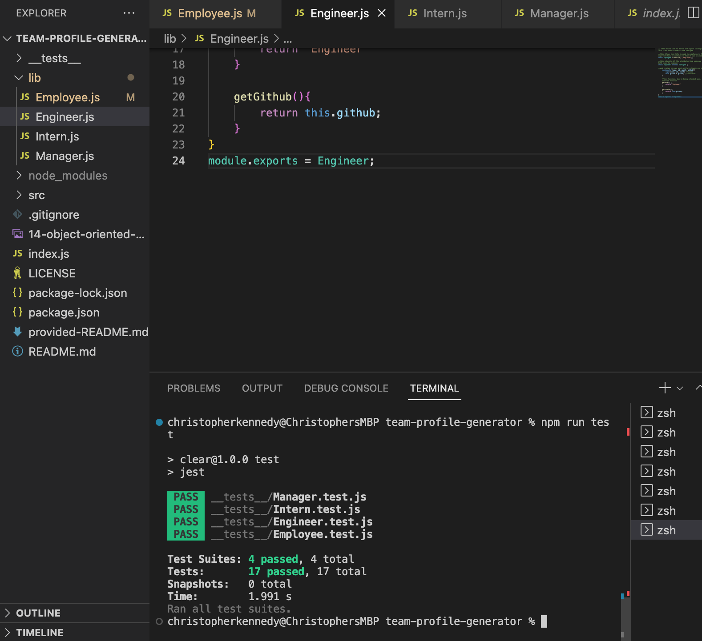

# team-profile-generator

This repo contains all the relevant files for my team profile generator

## Description

Fot this Project i had to create a team profile generator using Node.js, Inquirer and Jest. This resulted in creating a command-line application that contained information about employees on a software engineering team and then using the data on members to generate a html page that displays summeries about each member. The members include a manager, engineer and an intern. Using OOP (object-orinated programming) i was able to create collections of related data built on a key:value structure for each member.

I then used Jest to see if my code passed all the provided tests.

## Table of Contents

- [Screenshots](#screenshots)
- [License](#license)

## Screenshots

## License

MIT licence

---

© 2022 edX Boot Camps LLC. Confidential and Proprietary. All Rights Reserved.
